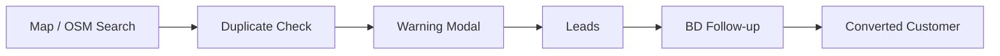

# EatQ CRM — Architecture

> Current architecture reference for the AI 餐飲業開發 / 多人 BD 協作 CRM SaaS MVP.  
> Product context lives in [`PROJECT_OVERVIEW.md`](./PROJECT_OVERVIEW.md); current milestone status lives in [`PROJECT_STATUS_2026-05.md`](./PROJECT_STATUS_2026-05.md).

---

## Product Boundary

EatQ is currently optimized for one BD collaboration workflow:

The product is intentionally **not** an ERP, KPI dashboard, finance system, task manager, or fake analytics dashboard.

---

## Runtime Stack

| Layer | Current Choice |
|-------|----------------|
| App framework | Next.js App Router |
| UI | React client components, mostly inline styles |
| Database | Supabase PostgreSQL |
| Browser DB client | `@supabase/supabase-js` via `lib/supabase.ts` |
| Map data | OSM / Overpass / Nominatim |
| AI generation | Pitch copy assist only, currently mock generator in `lib/pitchGenerator.ts` |

---

## Product Source Of Truth

EatQ production direction is **多人 BD 協作開發 SaaS**. Any refactor should preserve this table before changing UI:

| Page / Area | Status | Product Role | Notes |
|-------------|--------|--------------|-------|
| `/dashboard/map` | Production workflow | Search restaurants and start BD intake | Must check duplicates before inserting leads |
| Map duplicate warning modal | Production workflow | Prevent duplicate BD development | Shows owner, last follow-up, status; user can view record or intentionally add |
| `/dashboard/pipeline` | Production workflow | BD collaboration workspace | Store, owner, contact, phone, LINE, status, notes |
| `/dashboard/clients` | Production workflow | Lightweight converted-customer overview | Store, BD owner, status, contact info, last follow-up, notes |
| `/dashboard/email` | Production assist | Generate outreach copy | AI assists pitch writing only; explicit preview/save flow |
| `/dashboard/ai` | Production assist | BD manual observation | No fake scores; fields are store problem, pain point, recommended direction, notes |
| `/dashboard/ai-diagnosis` | Deprecated demo | Old review-score diagnosis | Must not be used as production workflow |
| `/dashboard/tracker` | Deprecated demo | Old usage/contract tracker | Contains fake usage/risk style concepts; do not build on it |
| `businesses` / seeded reviews | Deprecated demo data | Prototype support only | Must not drive production BD workflow |

Do not reintroduce:

- fake AI scores
- fake restaurant demo reviews as product truth
- usage rate dashboards
- fake revenue cards
- risk dashboards
- ERP/task/finance modules

---

## Data Model

### `leads`

`leads` is the primary BD collaboration table. It represents prospects and prevents multiple BD members from developing the same restaurant without context.

Key responsibilities:

- Map intake from OSM
- Duplicate warning by `osm_id`, `store_name`, and `address`
- Manual lead creation
- BD owner, contact info, status, notes
- Last follow-up timestamp
- BD manual observation summary in `ai_summary`
- Saved pitch content in `pitch_email`

Active status values:

- `new`
- `contacted`
- `interested`
- `meeting`
- `negotiating`
- `converted`
- `lost`

Main files:

- `scripts/leads-table.sql`
- `scripts/leads-bd-collaboration-migration.sql`
- `lib/leads.ts`
- `app/dashboard/pipeline/page.tsx`
- `app/dashboard/email/page.tsx`

### `customers`

`customers` is only a lightweight converted-customer record. It should not become ERP or fake SaaS metrics.

Key responsibilities:

- BD owner
- Status
- Contact info
- Last follow-up via linked lead
- Customer notes

The active UI intentionally hides fake indicators such as AI review-analysis addons, usage rate, monthly revenue, and risk status until real data sources exist.

Main files:

- `scripts/customers-table.sql`
- `scripts/customers-plan-features-migration.sql`
- `lib/customers.ts`
- `app/dashboard/clients/page.tsx`

---

## Active Workflow Contracts

1. Map search writes new prospects into `leads`.
2. Before inserting, map add checks `osm_id`, name, and address for existing leads.
3. If a match exists, show a warning modal with owner, last follow-up, and status.
4. The user can view the existing record or intentionally add another lead.
5. Pipeline cards focus on BD collaboration fields: store, owner, contact, phone, LINE, status, notes.
6. Converted customers stay lightweight and do not introduce ERP/KPI/finance modules.
7. Manual observation can support pitch generation, but it does not produce fake diagnosis scores.

This keeps the product centered on multiplayer BD coordination instead of dashboards.

---

## Current Non-Goals

- No timeline/task module in this phase.
- No ERP-style MOU document workflow.
- No KPI dashboard.
- No finance dashboard.
- No automatic outreach sending.
- No complex multi-step AI agent.

