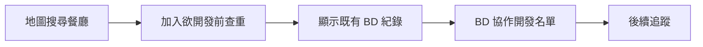

# EatQ CRM — Project Status (2026/05)

> **Document type:** Development milestone · workflow · MVP status log  
> **Not a replacement for:** [`PROJECT_OVERVIEW.md`](./PROJECT_OVERVIEW.md) (product/architecture reference)  
> **Last updated:** 2026-05

---

## Product positioning

**EatQ** is currently refocused as:

> **餐飲業 AI 業務開發 / 多人 BD 協作 CRM SaaS**

### Core concept



### Current priority

- **Do:** Build a smooth **BD collaboration workflow** that avoids duplicate development.
- **Don't:** Build ERP, KPI, finance, task, or fake SaaS dashboard features.

**Success metric for this phase:** Does the workflow *feel* complete for a sales rep—not how many modules exist.

---

## Milestone summary

| Milestone | Status | Notes |
|-----------|--------|-------|
| OSM map search (Overpass) | ✅ Done | Pipeline stable; enrich **frozen** |
| Supabase `leads` persistence | ✅ Done | First real persistence layer |
| Map → pipeline intake | ✅ Done | `osm_id` dedup, `source=osm` |
| Pipeline light CRM | ✅ Done | Status, notes, pitch state |
| Pitch email AI workflow (Mock) | ✅ Done | Preview → save → pipeline sync |
| Pitch direction system | ✅ Done | 7 directions, required before generate |
| Multi-channel templates | ✅ Done | Email / LINE / IG / phone |
| Customer System V1 | ✅ Done | `leads` → `customers` conversion via 簽MOU |
| Editable Client CRM v1 stabilization | ✅ Done | Plan / AI addons split; BD owner added |
| BD collaboration refocus | ✅ Done | Duplicate warning modal + owner/status/follow-up fields |
| Product direction recovery | ✅ Done | AI diagnosis replaced by BD manual observation; source-of-truth added |

**First complete SaaS workflow:**

> **找店 → 加入前查重 → 顯示既有 BD 紀錄 → 加入 / 查看 → BD 協作追蹤**

---

## Completed — checklist

### ✅ 1. OSM 地圖搜尋（Overpass API）

- [x] 地圖即時定位
- [x] 區域搜尋店家
- [x] 半徑搜尋（1km 等級策略）
- [x] OSM 店家列表 + 距離 + 類型
- [x] 地址 enrich（部分成功；品質受 OSM 資料限制）
- [x] OSM pipeline 可穩定運作

**Related:** `app/dashboard/map/`, `app/api/overpass/`, `lib/overpass.ts`, `OSM_ENRICHMENT_ROADMAP.md` (frozen)

---

### ✅ 2. Supabase 正式串接

- [x] `leads` table 建立（`scripts/leads-table.sql`）
- [x] insert / update / query
- [x] 狀態切換、備註儲存

**Significance:** First **production-style persistence layer** for the product (not mock-only UI).

---

### ✅ 3. 地圖 → 欲開發名單 workflow

- [x] 地圖搜尋 →「加入欲開發」→ 寫入 `leads`
- [x] Pipeline 頁顯示
- [x] 加入前查重（`osm_id` / 店名 / 地址）
- [x] `source=osm`, `status=new`

**Related:** `lib/leads.ts` → `addLeadFromOsm()`, `app/dashboard/map/OsmPlaceCard.tsx`

---

### ✅ 4. Pipeline 名單頁 MVP（輕 CRM）

- [x] 店家卡片、狀態、備註、刪除
- [x] 手動新增店家
- [x] 推銷信狀態（⚪ 尚未 / ✅ 已產生 + 摘要）
- [x] 「推銷信」→ `email?leadId=`

**Explicitly not:** Full visit ERP, MOU, contact matrix, permissions.

**Related:** `app/dashboard/pipeline/page.tsx`

---

### ✅ 5. 推銷信 AI workflow MVP

- [x] `leadId` 驅動 email 頁
- [x] 選推銷方向 → 生成（**僅預覽**）→ **儲存**才寫入 DB
- [x] Mock AI generator
- [x] `pitch_email` JSON 儲存（四渠道）
- [x] Pipeline 狀態同步（`?saved=1` + reload）

**Related:** `app/dashboard/email/page.tsx`, `lib/pitchGenerator.ts`

---

### ✅ 6. 推銷方向系統

使用者**必須先選方向**才能生成推銷信。方向寫入 `ai_summary`（`【推銷方向】…` 格式）。

| 方向 |
|------|
| 剩食變收入 |
| 排隊優化 |
| Google評論 |
| 外送導流 |
| 會員經營 |
| AI痛點分析 |
| 行銷曝光 |

---

### ✅ 7. 多平台推銷模板

- [x] **Email** — 正式、完整
- [x] **LINE** — 短句、口語
- [x] **IG/FB** — 社群、較輕鬆
- [x] **電話腳本** — 業務話術結構

不再共用同一份模板字串。

---

### ✅ 8. Customer System V1 — editable customers

- [x] `customers` table 建立（正式客戶與 leads 分離）
- [x] Pipeline「簽MOU」建立 customer record，原 lead 標記為 `converted`
- [x] `/dashboard/clients` 從 `customers` table 讀正式客戶
- [x] Client card 支援「編輯」→「儲存 / 取消」
- [x] 現在只保留 BD 負責人、聯絡人、電話、LINE、狀態、備註
- [x] 儲存後 update Supabase `customers` 並顯示「客戶資料已更新」
- [x] 已從 UI 移除假 SaaS 指標：AI 評論分析、使用率、月營收、風險狀態

**Explicitly not:** timeline、task、ERP、KPI dashboard、finance dashboard、fake usage/revenue metrics。

**Related:** `scripts/customers-table.sql`, `scripts/customers-plan-features-migration.sql`, `lib/customers.ts`, `app/dashboard/clients/page.tsx`

---

### ✅ 9. BD collaboration refocus — avoid duplicate development

- [x] `leads` 新增 `owner_name`, `contact_name`, `phone`, `line_id`, `last_follow_up_at`
- [x] `status` enum 改為 BD 開發階段：`new`, `contacted`, `interested`, `meeting`, `negotiating`, `converted`, `lost`
- [x] 地圖「加入欲開發」前先以 `osm_id`, 店名, 地址查重
- [x] 若已存在，顯示 warning modal：BD 負責人、最後追蹤時間、開發狀態
- [x] Modal 提供「查看紀錄」與「仍要加入」
- [x] Pipeline 卡片聚焦 BD 協作欄位：店名、聯絡人、電話、LINE、BD 負責人、開發狀態、備註

**Related:** `scripts/leads-bd-collaboration-migration.sql`, `lib/leads.ts`, `app/dashboard/map/page.tsx`, `app/dashboard/pipeline/page.tsx`

---

### ✅ 10. Product direction recovery — remove fake demo paths

- [x] `/dashboard/ai` 改為 BD 手動觀察：店家問題、痛點、推薦方向、備註
- [x] AI 僅作為推銷信文案輔助，不再做 fake score / fake review diagnosis
- [x] `/dashboard/ai-diagnosis` 標記為 deprecated，導回 `/dashboard/ai`
- [x] Global search 不再查 `businesses` demo data
- [x] `/dashboard/clients` 維持 SaaS CRM card overview：店名、BD負責人、狀態、聯絡資訊、最後追蹤、備註
- [x] `ARCHITECTURE.md` 新增 Product Source Of Truth，標記 production workflow / temporary assist / deprecated demo

**Related:** `app/dashboard/ai/page.tsx`, `app/dashboard/ai-diagnosis/page.tsx`, `app/dashboard/layout.tsx`, `ARCHITECTURE.md`

---

## Primary workflow (MVP)

### Happy path

```
1. 地圖：區域搜尋 OSM 店家
2. 點「🎯 加入欲開發」
3. 系統先查 `leads` 是否已有同店家
4. 若已存在：顯示 BD 負責人、最後追蹤、開發狀態
5. 使用者選擇「查看紀錄」或「仍要加入」
6. Pipeline 更新 BD 負責人、聯絡方式、開發狀態、備註
```

### Data touchpoints

| Step | Table / field |
|------|----------------|
| 加入前查重 | `leads` query by `osm_id`, `store_name`, `address` |
| 加入名單 | `leads` insert (`store_name`, `address`, `category`, `source`, `osm_id`, `owner_name`, `status='new'`) |
| 協作追蹤 | `leads` update (`owner_name`, `contact_name`, `phone`, `line_id`, `status`, `notes`, `last_follow_up_at`) |
| BD 觀察 | `/dashboard/ai` manual observation → `leads.ai_summary` or email query context |
| 轉換客戶 | `customers` insert + `leads.status` ← `converted` |

### Intentionally out of scope (for now)

- [ ] 大型 CRM / ERP
- [ ] KPI / finance / fake SaaS dashboard
- [ ] 完整拜訪流程、MOU 簽約流
- [ ] 複雜權限與多租戶
- [ ] AI 自動分析「所有」評論（無人工貼上）
- [ ] OSM 路名 enrich 持續投入（**frozen**）

**Rationale:** Optimize **workflow clarity** over feature count.

---

## Architecture notes (May 2026)

### Dual data paths on map (awareness)

| Mode | Source | MVP主线 |
|------|--------|---------|
| 區域搜尋 | OSM / Overpass | **Yes** → `leads` |
| 潛在客戶列表 | Supabase `businesses` | Legacy / demo seed |

### Mock AI → OpenAI (planned swap)

| Layer | File | Function |
|-------|------|----------|
| Generation | `lib/pitchGenerator.ts` | `generateMockPitch()` |
| UI trigger | `app/dashboard/email/page.tsx` | `handleAiGenerate()` |

Persistence (`serializePitch`, `updateLead`, pipeline `hasPitch`) can stay.

### Leads vs customers

| Stage | Table | Purpose |
|-------|-------|---------|
| 欲開發 / outreach | `leads` | Map intake, duplicate warning, BD owner, contact info, development status, notes |
| 正式客戶 / CRM | `customers` | Lightweight converted-customer contact record |

Fake SaaS indicators are hidden from the active UI until real data sources exist. Current work should not add ERP, KPI, finance, task, usage-rate, revenue, or risk dashboards.

Migration note: existing Supabase projects should run `scripts/leads-bd-collaboration-migration.sql` after updating the app code.

### Legacy code still in repo

Older `businesses` demo data and tracker-era CRM UI exist but are **not** the active MVP path. New prospect work should target **`leads`**; converted-client work should target **`customers`**.

---

## Lessons learned

### Technical

- **Next.js App Router:** routing + client state + `Suspense` / `searchParams` patterns matter for email & pipeline reload.
- **Supabase CRUD:** first stable contract was `leads`; schema in `scripts/leads-table.sql`.
- **OSM / Overpass / Nominatim:** open data quality caps display names & roads—not always a code bug.
- **Cache & bundles:** UI can look “stuck on old version” (`v12` vs `v15`); fix = new modules + clear build markers + restart dev server + clear `.next`.
- **sessionStorage:** map OSM session restore works; separate from DB persistence.
- **Preview vs save:** generating pitch must **not** write DB until explicit save—otherwise pipeline state lies.

### Product / process

- SaaS time goes to **workflow, UX, state flow, persistence sync**—not only screens.
- **MVP thinking:** one closed loop beats ten half-modules.
- **“No progress” feeling** often means state/UI/DB misalignment, not missing features.

### Biggest mindset shift

> 以前：「花很多時間卻沒進度」  
> 現在：理解大量時間在 **workflow + persistence + routing + API sync** — 這就是 SaaS。

---

## Product state (May 2026)

| Before | Now |
|--------|-----|
| 概念 demo | **可運作的 AI SaaS MVP** |
| 假資料 UI | **Supabase-backed leads** |
| 單頁功能 | **端到端 workflow** |

---

## Next steps (recommended priority)

### P0 — workflow polish

1. [ ] 推銷信 UX 微調（地圖加入後可選直跳 email、預覽/儲存提示一致）
2. [ ] AI 分析頁結果 **真正接入** 推銷方向 / 文案（非僅手選方向）
3. [ ] OpenAI API 取代 `generateMockPitch()`

### P1 — pipeline utility

4. [ ] Pipeline 搜尋 / filter（店名、狀態、是否已有推銷信）
5. [ ] 從 pipeline 一眼看出「待生成推銷信」清單

### P2 — data enrichment

6. [ ] Google Places / 店家資訊補強（見 `OSM_ENRICHMENT_ROADMAP.md`）
7. [ ] AI 自動摘要評論（可控範圍，非全量爬蟲）

### P3 — ops

8. [ ] 拜訪紀錄 timeline（輕量，非 ERP）
9. [ ] 部署正式環境（Vercel + Supabase prod keys）

### Not recommended next

- ❌ 直接 ERP 化（MOU、完整拜訪、多角色、複雜表單）
- ❌ 繼續深挖 OSM road enrich debug

---

## Key files (quick reference)

| Area | Path |
|------|------|
| Leads schema | `scripts/leads-table.sql` |
| Leads API helpers | `lib/leads.ts` |
| Customers schema | `scripts/customers-table.sql` |
| Customers migration | `scripts/customers-plan-features-migration.sql` |
| Customers API helpers | `lib/customers.ts` |
| Mock pitch + directions | `lib/pitchGenerator.ts` |
| Map | `app/dashboard/map/page.tsx`, `OsmPlaceCard.tsx` |
| Pipeline | `app/dashboard/pipeline/page.tsx` |
| Editable clients CRM | `app/dashboard/clients/page.tsx` |
| Email workflow | `app/dashboard/email/page.tsx` |
| OSM enrich (frozen) | `OSM_ENRICHMENT_ROADMAP.md` |
| Task backlog | `TODO.md` |

---

## Changelog (this document)

| Date | Note |
|------|------|
| 2026-05 | Stabilized Editable Client CRM v1: split plan from AI addons and added BD owner |
| 2026-05 | Added Customer System V1 and Editable Client CRM Phase 1 |
| 2026-05 | Initial status log: MVP workflow complete (map → leads → pitch → pipeline) |

---

*EatQ — 餐飲業 AI 業務開發 / CRM SaaS · Milestone log May 2026*
